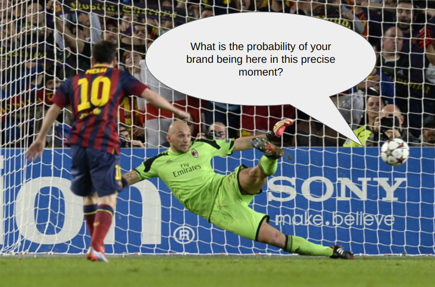
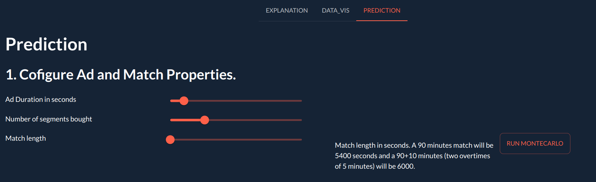
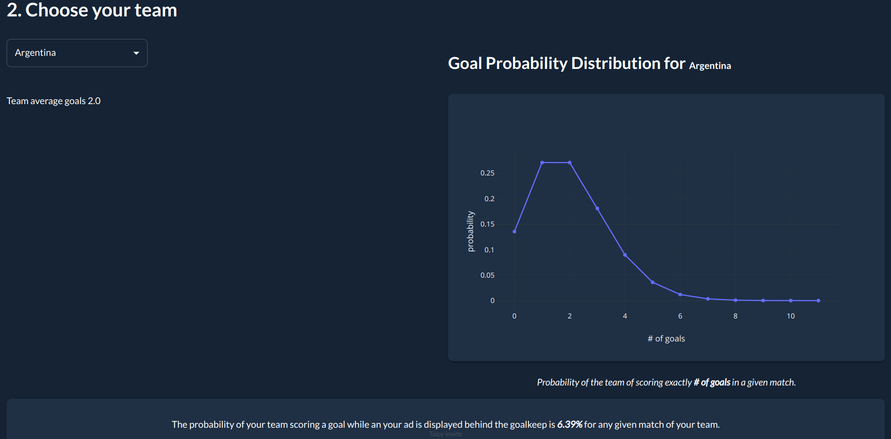
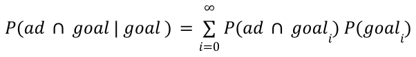

# Futbol Publicity Probability Simulator

### Do you ever wonder what is the probability of your brand being displayed in the precise moment of your favorite team scoring a goal?


This probability depends on many factors, including
* the amount of time bought to the publicity agent </li>
* the probability of your team scoring a goal during a match </li>
* the length of the match </li>

Solving this problem has many usages in marketing, helping you answer questions like
* How much time of Ads should buy to have a 1 in 10 chance of that happening?
* How much my Ads company should charge for the publicity?

This simple app help you calculate the odds and shed some light on the matter.

## Using the app
### Step 1 (configure and run the montecarlo)
Navigate to the PREDICTION tab and configure the simulation. Ads are bougtht by segments of a certain duration. If you bought 6 segments of 30 seconds, configure **Ad Duration** to be 30 and **Number of segments bought** to 6. The length of the match is in seconds. By default, ~~soccer~~ futbol matches are two times of 45 minutes. That is 5400 seconds in total. But is usual to have overtimes at referee discretion. We saw matches with over 10 extra minutes played during the FIFA World Cup 2022. 



Once everythin is configured, press the **Run Simulation** button to execute the Montecarlo Simulation and determine the probability of a goal and an ad happen at the same time. This step take some time of computation as the simulation is not very efficient.

### Step 2 (Choose your team)
Each team have a probability of score a certain number of goals per match, thus affecting the final probability. For example, Qatar National Team has an average goals per match of 0.3. The probabilities of Qatar making 0 goals in any given match is near 70%. And if your team scores 0 goals, the overall probability is also 0. For more on this, read through the **Considerations** Subsection.



##Installation
To test the app, clone the repo.
```
git clone https://github.com/jwackito/football-publicity-simulator.git futbol
cd futbol
```
Install the dependencies (taipy, numpy and pandas).
```
pip install -r requeriments.txt
```
Run the app. The first MonteCarlo simulation is run at startup. It should take less than 30 seconds but can be longer depending on your computer.
```
python main.py
```
When the `* Debug mode: on` line is shown, the app is ready. Open a browser and point it to `http://127.0.0.1:5000` and enjoy!

## Theory behind the problem
Using montecarlo simulations, it is possible to calculate the probability <b>P(goal)</b> of your team scoring a goal during a given match, and the probability <b>P(ad ∩ goal)</b> of your team scoring a goal while the ad of your brand is being displayed behind the goalkeep.

The probability <b>P(goal)</b> is based on the historical average amount of goals of your team. It can be modeled using a Binomial distribution. The probability <b>P(goal<sub>i</sub>)</b> of your team scoring exactly <b>i</b> goals is a random variable with distribution <b>X ~ Bin(n, p)</b> with <b>n</b> being the number of seconds played in a match and <b>p</b> the historical average of goals per match divided by the number of seconds played in the match. For Argentina, with an average number of goals per match of <b>2</b> and a normal football match of 90 minutes, the goal distribution is X ~ Bin(90\*60, 2/(90\*60)). You can see the distrubutions for several national teams in the DATA_VIS tab. The bigger the average the bigger the probability of scoring several goals. However, notice how unlikely is for ever team to score more than 10 goals.

The probability <b>P(ad ∩ goal)</b> can be calculated using montecarlo simulations for each amount of goals in a match. Obviously, if your team scores 0 goals, the probability <b>P(ad ∩ goal)</b> will be 0 too. But the more goals your team score in a match, the more probable <b>P(ad ∩ goal)</b> becomes. I calculated this probabilities independently for several different amount of goals (that is <b>P(ad ∩ goal<sub>i</sub>)</b>), but this distribution do not depend on the team scoring the goals. The simulator "plays" several matches, choosing at random the moment of a goal and the moment of and ad happening. After several simulations, is possible to compute the probability simply by counting the times the ad and the goal happen at the same time and dividing by the number of simulations.

As the two probabilities, <b>P(goal<sub>i</sub>)</b> and <b>P(ad ∩ goal<sub>i</sub>)</b> are independent, the final probability <b>P(ad ∩ goal|goal)</b> can be calculated as the sum of the product of the probabilities.

<center></center>

### Considerations
The probability distribution of a team making a goal on any given match maybe tricky to calculate. I'm using a Binomial distribution based on the historical average goals per match of each team. But intuitively, a team like Argentina has more chances to make a goal against Qatar or Wales than against Brazil or Germany. This is not considered by my approximation.

The duration of the goal event is also important. I'm considering the event of a goal to last for 1 second, but the play before the goal may be important. And also the cheering after the goal, for example, if you want to see your Ad near Messi *festejando* a goal. It is posible to modify the code to consider a goal event longer than 1 second.

The number of MonteCarlo simulations affect the stability of the results. The more simulations the more accurate the result will be, but the longer it will take to compute the answer. I compromised the app to be usable and restricted the number of simulations to 2000 per goal. That is, 2000 simulations for a match with 1 goal, 2000 simulations for a match with 2 goals, and so on. I restricted also the number of goals simulated to 10, as for most of the teams, is very unlikely to score more than 10 goals in a single match. A good number of simulations to avoid result instability will be over 100 000. 

## Disclaimer
This is a One Day Project challenge I did to learn how to use [Taipy](https://www.taipy.io/) library. If you are using this app to make decisions over a couple of thousands dollars spent in publicity, then either you have money to burn or you are crazy. In either case, I can help you make a better prediction for a fraction of the publicity money per second ;) 

